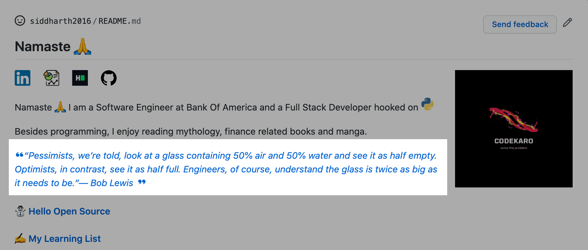

# Random Quote/Fact on README [](https://travis-ci.org/github/siddharth2016/quote-readme)


---

## GitHub Action that allows you to place a random quote/fact on your README



---

## Random Quote/Fact on your (Profile) Readme

### How To Use This Action

There is a short tutorial with enough steps for you to get started with this not-so-useful GitHub Action. Check that out [here](https://blog.codekaro.info/quote-readme-see-wonderful-quotesfun-facts-on-your-github-profile-readme).

If you want to get an in-depth idea on the usage of this action, please follow the below points.

### Prepare Your Repository

1. You need to update the markdown file(.md) with 2 comments. You can refer [here](#update-your-readme) for updating it.
2. **Optional** You'll need a GitHub API Token with `repo` scope from [here](https://github.com/settings/tokens) if you're running the action for a non profile repository.
   - You can use [this](#other-repository-not-profile) example to work it out.
3. You can follow any one example below according to your needs to get started !
   - Use [this](#profile-repository) on Profile Repository.
   - Use [this](#other-repository-not-profile) on any other Repository.
4. It is better to run the Action on your Profile Repository, since you won't be needing a GitHub Access Token !
5. Check [this](#examples) to see available options while creating a workflow for this action.

---

### Update Your Readme

Add a comment to your `README.md` like this:

```md
<!--STARTS_HERE_QUOTE_README-->
<!--ENDS_HERE_QUOTE_README-->
```

You can place these 2 lines anywhere you want quotes/facts to be displayed.

---

### Profile Repository

_If you're executing the workflow on your Profile Repository  (`<username>/<username>`)_

You wouldn't need a GitHub Access Token since GitHub Actions already makes one for you.

Please follow the steps below:

1. Go to your `<username>/<username>/actions`, hit `New workflow`, then `set up a workflow yourself`, delete all the default content github made for you.
2. Copy the following code and paste it to your new workflow you created at step 1, commit the workflow and name it whatever you like !

```yml
name: Update Quote Readme

on:
  workflow_dispatch:
  schedule:
    # Runs at 2 UTC everyday
    - cron: "0 2 * * *"

jobs:
  update-readme:
    name: Update Quote README
    runs-on: ubuntu-latest
    steps:
      - uses: siddharth2016/quote-readme@main
```

3. There is another tag as well you can use, `OPTION` that would allow you to specify what you want either a quote or a fact to be displayed, by default it is `both`. Check [examples](#examples) for more.
4. Add a comment to your `README.md` like this:

```md
<!--STARTS_HERE_QUOTE_README-->
<!--ENDS_HERE_QUOTE_README-->
```

5. Go to Workflows menu (mentioned in step 1), click `Update Quote Readme`, click `Run workflow`.
6. Go to your profile page, you will be able to see a random quote/fact wherever you placed [this](#update-your-readme) comment on README.

---

### Other Repository (not Profile)

_If you're executing the workflow on another repo other than (`<username>/<username>`)_

You'll need to get a [GitHub Access Token](https://docs.github.com/en/actions/configuring-and-managing-workflows/authenticating-with-the-github_token) with a `repo` scope.

You need to save the GitHub API Token in the repository secrets. You can find that in the Settings of your Repository.

1. Go to your `<username>/<differentrepo>/actions`, hit `New workflow`, then `set up a workflow yourself`, delete all the default content github made for you.
2. Copy the following code and paste it to your new workflow you created at step 1, commit the workflow with whatever name you like !

```yml
name: Update Quote Readme

on:
  workflow_dispatch:
  schedule:
    # Runs at 2 UTC everyday
    - cron: "0 2 * * *"

jobs:
  update-readme:
    name: Update Quote README
    runs-on: ubuntu-latest
    steps:
      - uses: siddharth2016/quote-readme@main
        with:
          GH_TOKEN: ${{ secrets.GH_TOKEN }}
          REPOSITORY: <username>/<differentrepo> # No need to mention this if workflow present in current non profile repo.
```

3. There is another tag as well you can use, `OPTION` that would allow you to specify what you want either a quote or a fact to be displayed, by default it is `both`. Check [examples](#examples) for more.
4. Add a comment to your `README.md` like this:

```md
<!--STARTS_HERE_QUOTE_README-->
<!--ENDS_HERE_QUOTE_README-->
```

5. Go to Workflows menu (mentioned in step 1), click `Update Quote Readme`, click `Run workflow`.
6. Go to your profile page, you will be able to see a random quote/fact wherever you placed [this](#update-your-readme) comment on README.

---

### Examples

1. If you want to use this action for a README that is not present in current workflow repository.

```yml
- uses: siddharth2016/update-readme-image@main
  with:
    GH_TOKEN: ${{ secrets.GH_TOKEN }}     # Needed if README repository is not profile repo
    REPOSITORY: <username>/<differentrepo>
```

Using `REPOSITORY` will change README present in that repository head.

For example, if your workflow is present in `<username>/repo1` and you want to update README present in `<username>/repo2`, then assign `REPOSITORY` to `<username>/repo2` in workflow at `<username>/repo1`.

2. You can specify a commit message to override the default _"Update with quote-readme"_.

```yml
- uses: siddharth2016/update-readme-image@main
  with:
    GH_TOKEN: ${{ secrets.GH_TOKEN }}     # Needed if README repository is not profile repo
    REPOSITORY: <username>/<differentrepo>  # Needed if README repository is not current repo
    COMMIT_MESSAGE: <your-commit-message>       # default - Update with quote-readme
```

3. You can also choose if you only want either a random `quote` or a random `funfact` to appear on your readme, by default it is `both`.

```yml
- uses: siddharth2016/update-readme-image@main
  with:
    GH_TOKEN: ${{ secrets.GH_TOKEN }}     # Needed if README repository is not profile repo
    REPOSITORY: <username>/<differentrepo>  # Needed if README repository is not current repo
    COMMIT_MESSAGE: <your-commit-message>       # default - Update with quote-readme
    OPTION: both            # default - both, can be one of (quote, funfact, both), if 'both' then will display either a quote or a fact
```

---

### Tests

To run tests simply execute the following in the directory containing `main.py`:

```bash
python -m unittest discover
```

---

#### Another intriguing action you would want to use - [update-readme-image](https://github.com/marketplace/actions/update-image-readme)

#### Check out the [scripts](https://github.com/siddharth2016/quote-readme/tree/main/scripts) folder to know more about how quotes/facts were retrieved

#### If you liked this Action and want to contribute to upgrade this utility, please create an issue or throw a PR !

---

#### Inspired From

[athul/waka-readme](https://github.com/athul/waka-readme)
